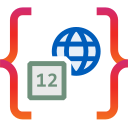

# Extensions for Globalization API by Codebelt

     

An open-source project (MIT license) that targets and complements the [System.Globalization](https://github.com/dotnet/runtime/tree/main/src/libraries/System.Private.CoreLib/src/System/Globalization) namespace. It aims to provide a way to favor National Language Support (NLS) over International Components for Unicode (ICU).

### 📦 Standalone Packages

Provides a focused API for RESTful versioning.

|Package|vNext|Stable|Downloads|
|:--|:-:|:-:|:-:|
| [Codebelt.Extensions.Globalization](https://www.nuget.org/packages/Codebelt.Extensions.Globalization/) |  |  |  |

### Contributing to `Extensions for Globalization API by Codebelt`
[Contributions](.github/CONTRIBUTING.md) are welcome and appreciated.

Feel free to submit issues, feature requests, or pull requests to help improve this library.

### License
This project is licensed under the MIT License - see the [LICENSE](LICENSE.md) file for details.
